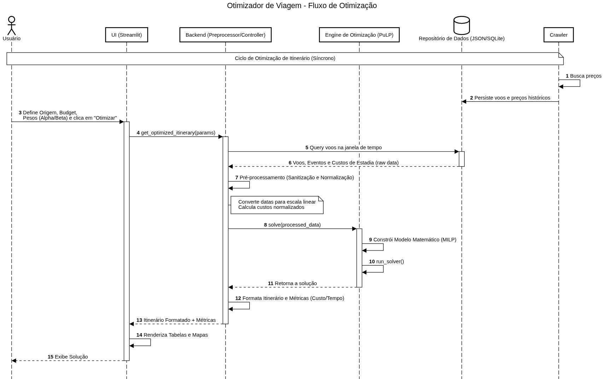

# Otimizador de Viagens

Sistema de otimização de rotas de viagem que utiliza web scraping para coletar dados de voos, hoteis e aluguel de carros, junto com uma interface Streamlit para visualização e otimização de itinerários.

## Estrutura do Projeto

``` text
otimizador_viagens/
├── docs # documentações
    ├── images # Imagens e diagramas
├── app.py # Aplicação Streamlit principal
├── scraper_local.py # Script de scraping do Google Flights
├── requirements.txt # Dependências Python
├── Dockerfile.streamlit # Dockerfile para o serviço Streamlit
├── docker-compose.yml # Configuração Docker Compose
├── .dockerignore # Arquivos ignorados no build Docker
├── voos_local.db # Banco de dados SQLite (gerado automaticamente)
└── utils/
└── br-us-airports.csv # Base de dados de aeroportos BR/US
```

## Funcionalidades

- **Interface Web (Streamlit)**: Interface amigável para configurar parâmetros de viagem
- **Busca de Aeroportos**: Autocomplete com base de dados de aeroportos Brasil/Estados Unidos
- **Scraping de Voos**: Coleta automática de preços e informações de voos do Google Flights
- **Scraping de Hospedagem de hotéis**: Coleta automática de preços de hospedagens
- **Scraping de aluguel de veículos**: Coleta automática de preços aluguel de veículos
- **Banco de Dados**: Armazenamento local em SQLite para histórico de voos coletados

## Pré-requisitos

- Docker e Docker Compose instalados
- Python 3.12+ (para execução local do scraper)
- Playwright (para o scraper)

## Diagrama de Sequencia


## Instalação e Configuração

### 1. Clone o repositório
```sh
git clone git@github.com:marcelobazevedo/otimizador_viagens.git

cd otimizador_viagens
```

### 2. Configurar variáveis de ambiente


Crie um arquivo `.env` na raiz do projeto (opcional, apenas se usar API Amadeus):

``` bash
AMADEUS_TOKEN=seu_token_aqui
```

### 3. Executar aplicação Streamlit com Docker

#### Construir e iniciar o container:

``` bash
docker-compose up -d streamlit-app
```

#### Ver logs:

``` bash
docker-compose logs -f streamlit-app
```

#### Parar o serviço:

``` bash
docker-compose down
```

#### Reconstruir após mudanças:

``` bash
docker-compose build streamlit-app
docker-compose up -d streamlit-app
```

A aplicação estará disponível em: `http://localhost:8501`


### 4. Configurar o Scraper

Execução manual do scraper.

#### Instalar dependências do scraper:

# Criar ambiente virtual (recomendado)
``` bash
python3 -m venv venv
source venv/bin/activate  # No Windows: venv\Scripts\activate
```

# Instalar dependências

``` bash
pip install -r requirements.txt
pip install playwright pandas python-dotenv
```


# Instalar navegador Chromium do Playwright
``` bash
playwright install chromium
``` 

#### Configurar rotas no scraper:

Edite o arquivo `scraper_local.py` e configure as rotas na variável `ROTAS`:

``` json
ROTAS = [
    {'origem': 'GYN', 'destino': 'ATL', 'data': '2025-05-15'},
    {'origem': 'ATL', 'destino': 'BSB', 'data': '2025-05-20'},
    # Adicione quantas rotas quiser
]
```

#### Executar o scraper:

``` bash
python scraper_local.py
```

O scraper irá:
- Abrir o navegador (headless=False para evitar detecção)
- Navegar pelo Google Flights
- Coletar dados de voos
- Salvar no banco `voos_local.db`

**⚠️ Importante**: O scraper usa `headless=False` para evitar detecção pelo Google. Certifique-se de ter um display disponível na VPS ou configure X11 forwarding.

## Agendamento do Scraper na VPS

Para executar o scraper periodicamente, configure um cron job:

### 1. Editar crontab:

crontab -e
### 2. Adicionar linha para executar diariamente às 2h da manhã:

``` bash
0 2 * * *
cd /caminho/para/otimizador_viagens && /usr/bin/python3 scraper_local.py >> /var/log/scraper.log 2>&1
```

Ou executar a cada 6 horas:

``` bash
0 */6 * * *
cd /caminho/para/otimizador_viagens && /usr/bin/python3 scraper_local.py >> /var/log/scraper.log 2>&1
```

### Estrutura da tabela `voos`:

- `id`: ID único do registro
- `origem`: Código IATA do aeroporto de origem
- `destino`: Código IATA do aeroporto de destino
- `data_voo`: Data do voo (formato: YYYY-MM-DD)
- `companhia`: Nome da companhia aérea
- `preco_bruto`: Preço em formato texto (ex: "R$ 1.500,00")
- `preco_numerico`: Preço em formato numérico (para ordenação)
- `coletado_em`: Timestamp de quando o dado foi coletado

### Consultar dados:

``` bash
sqlite3 voos_local.db
-- Ver todos os voos
SELECT * FROM voos;
``` 

``` bash
-- Ver voos de uma rota específica
SELECT * FROM voos WHERE origem='GYN' AND destino='ATL';
``` 

``` bash
-- Ver voos mais baratos
SELECT * FROM voos ORDER BY preco_numerico ASC LIMIT 10;
``` 

## Configuração Avançada

### Alterar porta do Streamlit

Edite `docker-compose.yml`:

``` yml
ports:
  - "8080:8501"  # Mude 8080 para a porta desejada
```

### Volumes Docker

O docker-compose monta os seguintes volumes:
- `./utils`: Base de dados de aeroportos (somente leitura)
- `./voos_local.db`: Banco de dados SQLite (leitura/escrita)

## Notas Importantes

- O scraper usa delays aleatórios para simular comportamento humano
- O Google pode detectar e bloquear scraping excessivo
- Recomenda-se executar o scraper com moderação (1-2 vezes por dia)
- O banco de dados é compartilhado entre o scraper e a aplicação Streamlit